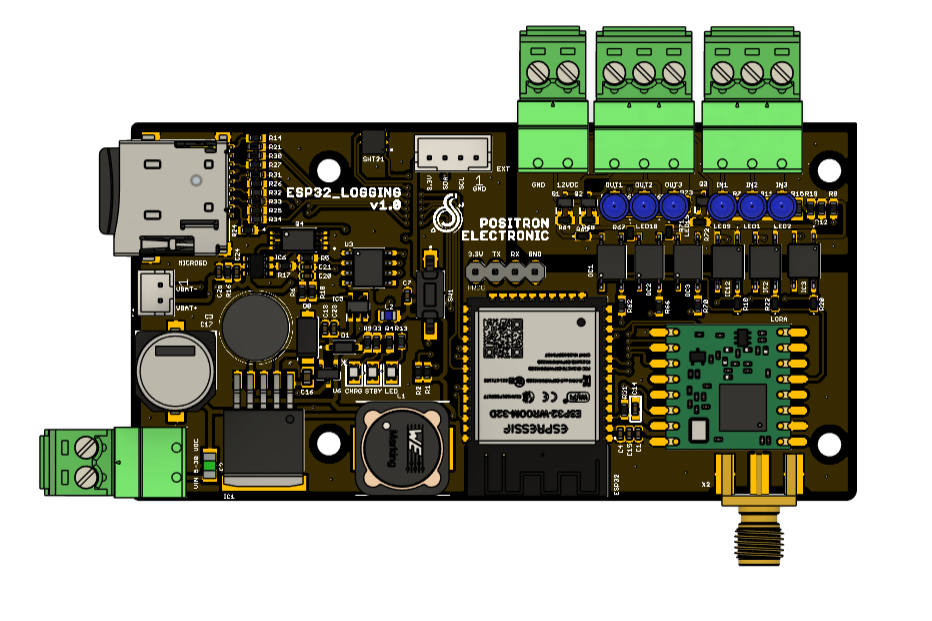
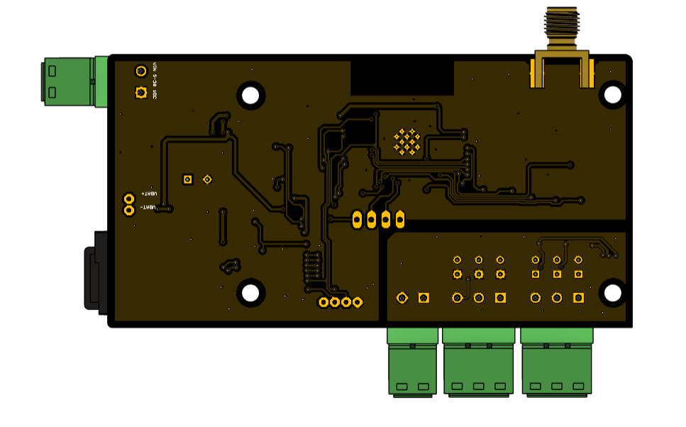
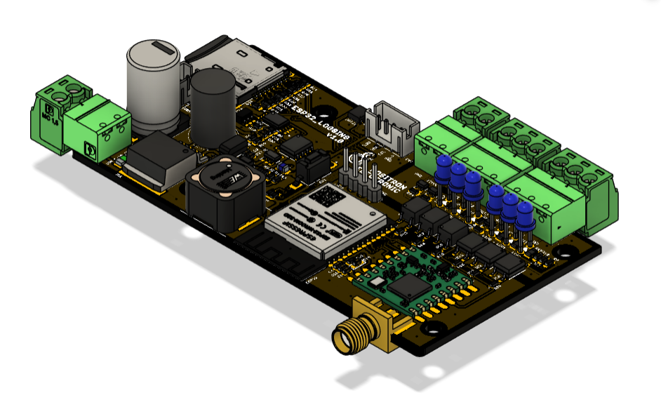

# ESP32_LOGGING

## Table of Content

* [Product Specsification](#product-specsification)
* [Technical Spesification](#technical-spesification)
* [Applications](#applications)
* [Advantages](#advantages)
* [Priview Hardware](#priview-hardware)
* [Documentation](#documentation)
  * [Pinout Diagram](#pinout-diagram)
  * [Dimension](#dimension)
  * [BOM](#bom)
  * [Schematic](#schematic0)
  * [Example Program](#examples-program)
* [FAQ](#FAQ)

## Preview Hardware

  
  
  

